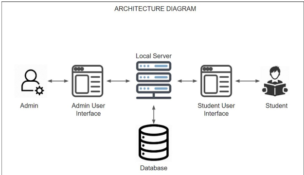

# PICT-Faculty-Student-Feedback-System
JSP and MySQL based online system to record feedback of students of all departments of PICT along with Report generation and visualisation of feedback data 
An application where students can give feedback used for semester assessment of
teachers provided to the students. These facilities include the teaching mechanism,
lab assistance, and services, cultural and sports activities conducted and library
maintenance, etc. PICT feedback system will help make the feedback assessment
much easier than previous along with providing an interactive interface for both
client and server-side. 
For more detail, Please refer the [SRS Document](SRS_Feedback_Management_System.pdf)
  
  
Our web application is able to provide the following services:
1. Students will be able to give feedback more intuitively and surf through on
their dashboard.
2. At the time of data entry in the admin side, efficient and fast flow through to
set up the system for feedback collection.
3. The feedback report is generated which takes into account the number of
students who have given that specific teacher.
4. Admin can be edited/deleted as and when required very easily.
5. Admin can also view the previous feedback recorded and generate reports of
a teacher in those feedbacks.
6. For more efficient setup entry through excel files is available which directly
takes in the teachers and subjects that are to be inserted into the system.
7. BE students elective can be separately mapped to specific teachers and their
subjects.
8. Question template feature for customizable question assignment to different
teachers.
9. Batch creation for lab provided for teacher allotment to various batches.
10.Feedback reports: The Feedback Reports will be made available on-screen
with an export facility in PDF format. This facility is available only to admin
to download.

## REQUIREMENTS
* Eclipse
* Glassfish server 4.1 
* Java 8 
* MySQL Server 
* Bootstrap/css/JQuery 
* Any Operating System 
* Any web browser on user side for accessing the internet

## Getting Started
main folder : JSP Eclipse project sql file : Mysql Database file
Just download the code, import in eclipse, create database in MySql and source from sql file.
